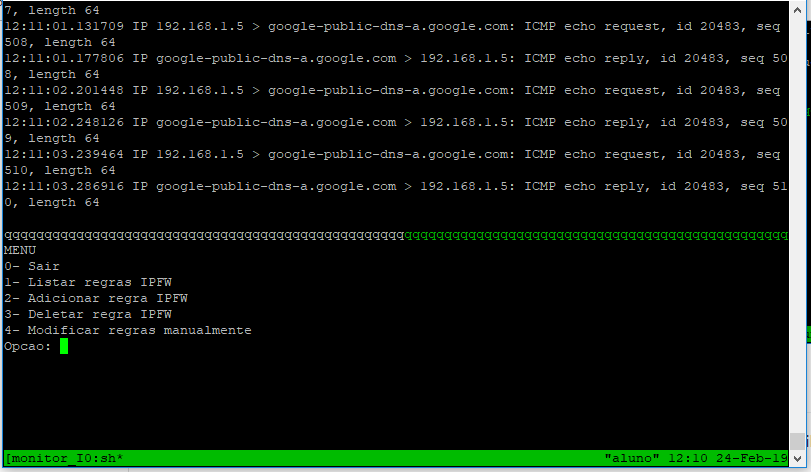

## Inicializar

1- Adicionar permissoes de execuxao para arquivos ".sh"

	chmod +x *.sh

2- Comecar instalando dependencias

	./install-dependencies.sh

3-Inicializar aplicação

	./script.sh <interfaace> <net|host>

OBS.: Exemplo de formato de rede "192.168.0.0/24"

4- Tela de exibição da aplicação

## Arquivo "install-dependeis.sh"

Executar arquivo para isntalação dos progrmas de dependênciaplicaacao.
Instalação de utilitário tcpdump e tmux

## Arquivo script.sh

Habilita o IPFW com politica padrao para "ALLOW ALL com ID 65000". 
Executa o tmux e trata de criar os paineis para para dividir a tela. 
Posteriormente excuta o arquivo "mennu.sh"

## Arquivo Menu.sh

Exibe o seguinte Menu:

	MENU
	0- Sair
	1- Listar regras IPFW
	2- Adicionar regra IPFW
	3- Deletar regra IPFW
	4- Moficar regras manualmente	

- Opcao "0": encerar a ferramenta e o processo.
- Opcao "1": lista as atuais regras IPFW
- Opcao "2": adiciona regras IPFW perguntando os seguintes tópicos

	- Numero da regra: resposta correspendente ao ID de ordememto da regra
	- Tipo da regra(deny|permit): habitualmente pode-se adiconar outros valores alem de "deny" "permit, mas este programa foi projetado inicialmente para estes dois
	- Protocolo(ex.: ip|icmp|tcp|udp|all): Protocolo que serao analisados na regra
	- Rede de origem(ex.: 10.0.0.1/32): rede de origem do trafego
	- Rede de destino(ex.: 10.1.0.2/32: rede de destino do trafego
	- Porta de Origem: porta de origem do tráfego
	- Porta de destino: porta de destino do tráfego
	- Fluxo do trafego(in/ou): Se o tráfego é de entrada ouaida da interface

- Opcao "3": deleta uma regra com base em seu ID
- Opcao "4": Para mudanca de regras que nao estao disponiveis dadas as limitacoes da aplcacao
